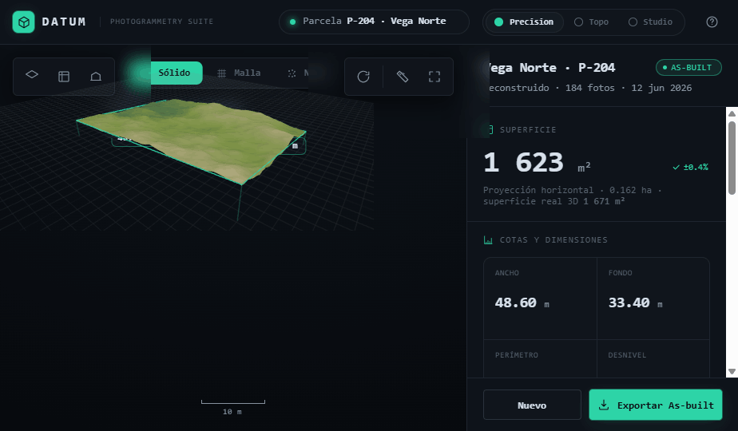

# DATUM — Photogrammetry Suite

> Turn site photographs into a **measurable, georeferenced 3D as-built** model — for architecture
> studios.

DATUM is a responsive (mobile + desktop) web app. You upload a set of photos of a plot, the app runs
them through a photogrammetry pipeline, and you get a navigable 3D model with real metric data:
surface, dimensions, elevations, accuracy (RMSE) and a georeferenced as-built ready to export to
CAD/GIS.

**Hero flow:** upload photos → process → navigable 3D result.

<p align="center">
  
</p>

---

## Tech stack

- **Vite** + **React 19** + **strict TypeScript**
- **Tailwind CSS v4** with design tokens (CSS variables) per theme
- **react-three-fiber** + **@react-three/drei** + **Three.js** for the 3D viewer
- **Zustand** for global state
- **Inter** (UI) + **Geist Mono** (all numeric data) via `@fontsource-variable`

Three switchable themes via `data-theme`: **`precision`** (default — dark, monospaced, turquoise),
**`dark`** (CAD dark "Topo"), **`light`** ("Studio").

## Getting started

```bash
npm install
npm run dev          # http://localhost:5173
```

Other scripts:

```bash
npm run build        # type-check + production build
npm run preview      # preview the production build
npm run typecheck    # tsc --noEmit
```

## Project structure

```
src/
├── App.tsx              App shell: TopBar + screen router
├── index.css           Tailwind + design tokens (3 themes)
├── theme/              Theme metadata
├── store/              Zustand global store
├── components/         TopBar + shared UI primitives
├── screens/            Upload · Processing · Viewer
├── viewer/             react-three-fiber scene, toolbars, layers
└── lib/                Pipeline client, metrics, geo helpers

reference/design-handoff/   Hi-fi design reference (source of truth) + screenshots
```

## Design reference

The full design spec, phased implementation plan and the original hi-fi prototype live in
[`reference/design-handoff/`](reference/design-handoff/):

- [`README.md`](reference/design-handoff/README.md) — complete design spec (tokens, screens,
  components, interactions, viewer behavior). **Source of truth.**
- [`IMPLEMENTATION.md`](reference/design-handoff/IMPLEMENTATION.md) — phased build plan with
  checklist.
- `screenshots/` — hi-res reference captures (3 screens + 3 themes).

To run the original vanilla prototype: `cd reference/design-handoff && npx serve .`

## How it works (production)

The 3D reconstruction runs on a **photogrammetry backend** (WebODM / Metashape / RealityCapture or a
custom service), not in the browser. The app:

1. Uploads photos → backend.
2. Polls reconstruction progress → drives the Processing screen.
3. Loads the resulting mesh (glTF) + a JSON of metrics & georeferencing → drives the Viewer and
   Inspector.
4. Exports the as-built to DXF / GeoJSON / glTF / PDF.

In this scaffold the data and terrain are **simulated** (procedural) for demo purposes.

## License

UNLICENSED — © Javier Cordero. All rights reserved.
